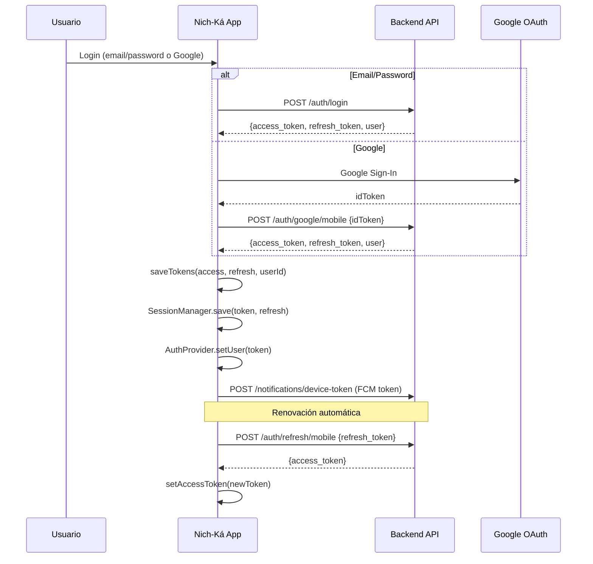
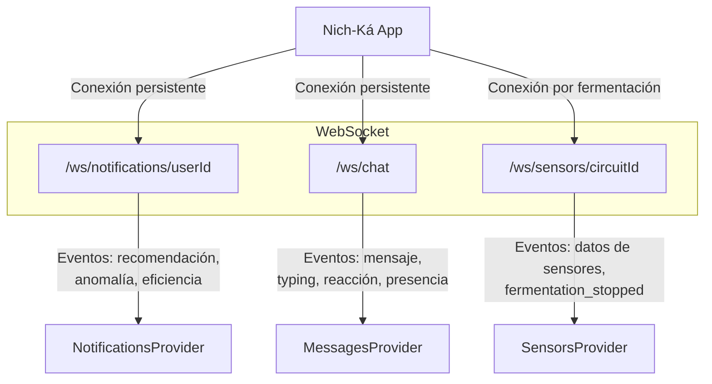
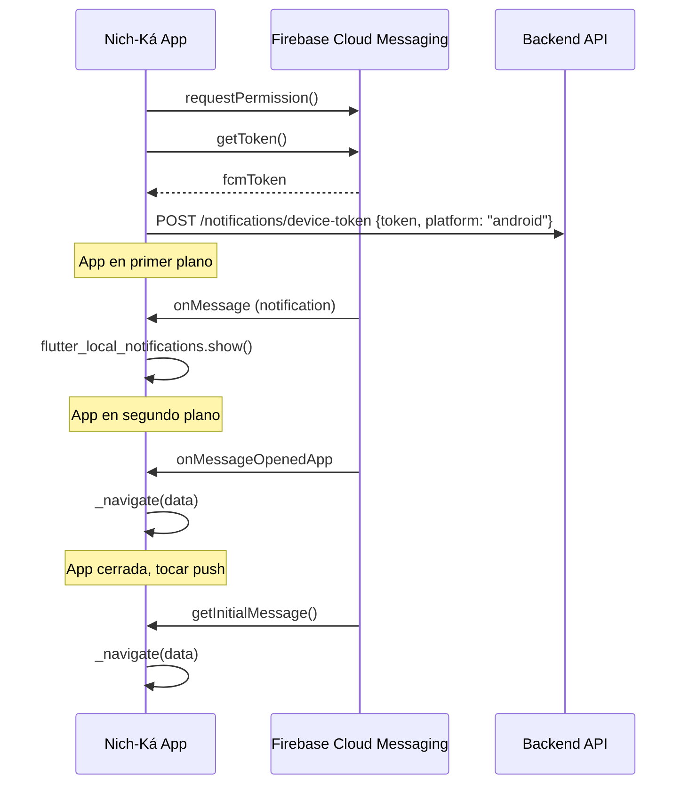
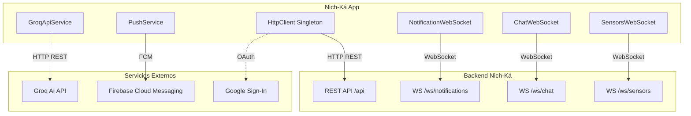

# Integración con APIs y Servicios Externos

Documento que describe la comunicación HTTP, WebSocket, autenticación y conexión con servicios backend de la aplicación Nich-Ká.

> **Versión documentada:** `1.0.0+22`

---

## Índice

- [Visión general](#visión-general)
- [Cliente HTTP centralizado](#cliente-http-centralizado)
- [Autenticación y manejo de tokens](#autenticación-y-manejo-de-tokens)
- [Endpoints REST por módulo](#endpoints-rest-por-módulo)
- [Conexiones WebSocket](#conexiones-websocket)
- [Servicio de IA (Groq API)](#servicio-de-ia-groq-api)
- [Notificaciones Push (FCM)](#notificaciones-push-fcm)
- [Diagrama de comunicación](#diagrama-de-comunicación)

---

## Visión general

La aplicación se comunica con 4 servicios externos:

| Servicio | Protocolo | URL base |
|---|---|---|
| Backend Nich-Ká | HTTP REST | `https://api.nich-ka.space/api` |
| Backend Nich-Ká | WebSocket | `wss://api.nich-ka.space` |
| Groq AI API | HTTP REST | `https://api.groq.com/openai/v1` |
| Firebase Cloud Messaging | FCM | Firebase.googleapis.com |
| Google Sign-In | OAuth 2.0 | accounts.google.com |

---

## Cliente HTTP centralizado

Todas las peticiones REST pasan por un singleton `HttpClient` (`core/network/http_client.dart`):

```dart
class HttpClient {
  HttpClient._();
  static final HttpClient instance = HttpClient._();

  // Headers automáticos con Authorization: Bearer <token>
  Map<String, String> _headers() => {
    'Content-Type': 'application/json',
    'Accept': 'application/json',
    if (_accessToken != null) 'Authorization': 'Bearer $_accessToken',
  };

  // Métodos disponibles
  Future<http.Response> get(String path);
  Future<http.Response> post(String path, Map<String, dynamic> body);
  Future<http.Response> put(String path, Map<String, dynamic> body);
  Future<http.Response> patch(String path, Map<String, dynamic> body);
  Future<http.Response> delete(String path);
  Future<http.Response> postMultipart(String path, List<http.MultipartFile> files);
}
```

### Características

- **Singleton**: Una sola instancia compartida por toda la app
- **Headers automáticos**: Incluye `Authorization: Bearer` cuando hay token
- **Tokens en memoria**: Access token, refresh token y userId
- **URL WebSocket derivada**: Convierte `http://` → `ws://` y elimina `/api`

---

## Autenticación y manejo de tokens

### Flujo de autenticación



### Persistencia de sesión

| Almacenamiento | Contenido | Paquete |
|---|---|---|
| `FlutterSecureStorage` | Refresh token + datos del usuario | `flutter_secure_storage` |
| `SharedPreferences` | Preferencia de tema (light/dark/system) | `shared_preferences` |
| Memoria (singleton) | Access token actual | `HttpClient` |

### Renovación de token

El `SessionManager` renueva el access token automáticamente usando el refresh token guardado:

```dart
Future<AuthToken?> restore() async {
  final data = jsonDecode(await _storage.read(key: _key));
  final response = await HttpClient.instance.post('/auth/refresh/mobile', {
    'refresh_token': data['refresh'],
  });
  // Si es exitoso → actualiza access token en memoria
  // Si falla → limpiar sesión, usuario debe re-loguearse
}
```

---

## Endpoints REST por módulo

### Autenticación (`/auth`)

| Método | Endpoint | Descripción |
|---|---|---|
| `POST` | `/auth/login` | Login con email y contraseña |
| `POST` | `/auth/google/mobile` | Login con Google (idToken) |
| `POST` | `/auth/forgot-password` | Solicitud de recuperación de contraseña |
| `POST` | `/auth/logout` | Cierre de sesión |
| `POST` | `/auth/refresh/mobile` | Renovación de access token |
| `POST` | `/users/me/change-password` | Cambio de contraseña |

### Usuarios y Perfil (`/users`)

| Método | Endpoint | Descripción |
|---|---|---|
| `GET` | `/users/me` | Obtener perfil del usuario actual |
| `GET` | `/users/{userId}` | Obtener perfil de un usuario específico |
| `PUT` | `/users/{userId}` | Actualizar datos del usuario |
| `POST` | `/users/me/profile-image` | Subir imagen de perfil (multipart) |

### Fermentaciones (`/fermentation`)

| Método | Endpoint | Descripción |
|---|---|---|
| `GET` | `/fermentation/active` | Obtener fermentación activa del usuario |
| `GET` | `/fermentation/sessions` | Lista de lotes/sesiones de fermentación |
| `GET` | `/fermentation/sessions-with-reports?limit=50` | Sesiones con reportes asociados |
| `GET` | `/fermentation/{sessionId}/report` | Detalle del reporte de una sesión |
| `GET` | `/fermentation/{sessionId}/report/pdf` | Descargar reporte en PDF |
| `GET` | `/fermentation/history` | Historial de fermentaciones |
| `POST` | `/fermentation/{sessionId}/predict-now` | Solicitar predicción inmediata |

### Notificaciones (`/notifications`)

| Método | Endpoint | Descripción |
|---|---|---|
| `GET` | `/notifications/?only_unread=false` | Obtener notificaciones |
| `PATCH` | `/notifications/{notificationId}/read` | Marcar una como leída |
| `PATCH` | `/notifications/read-all` | Marcar todas como leídas |
| `POST` | `/notifications/device-token` | Registrar token FCM del dispositivo |

### Clases / Grupos (`/groups`)

| Método | Endpoint | Descripción |
|---|---|---|
| `GET` | `/groups/me` | Obtener clases del usuario |
| `POST` | `/groups/join` | Unirse a una clase por código |

### Mensajería (`/chat`)

| Método | Endpoint | Descripción |
|---|---|---|
| `GET` | `/chat/contacts` | Obtener contactos disponibles |
| `POST` | `/chat/conversations` | Crear nueva conversación |
| `GET` | `/chat/conversations` | Lista de conversaciones |
| `GET` | `/chat/conversations/{id}` | Detalle de una conversación |
| `POST` | `/chat/conversations/{id}/members` | Agregar miembros |
| `POST` | `/chat/conversations/{id}/read` | Marcar como leída |
| `POST` | `/chat/conversations/{id}/delivered` | Marcar como entregada |
| `DELETE` | `/chat/conversations/{id}/leave` | Salir de una conversación |
| `PATCH` | `/chat/conversations/{id}` | Actualizar conversación |
| `GET` | `/chat/conversations/{id}/messages?cursor=&limit=` | Obtener mensajes (paginado) |
| `POST` | `/chat/conversations/{id}/messages` | Enviar mensaje |
| `PATCH` | `/chat/messages/{id}` | Editar mensaje |
| `DELETE` | `/chat/messages/{id}` | Eliminar mensaje |
| `POST` | `/chat/messages/{id}/pin` | Fijar/desfijar mensaje |
| `PATCH` | `/chat/messages/{id}/priority` | Cambiar prioridad |
| `POST` | `/chat/messages/{id}/reactions` | Toggle reacción |
| `POST` | `/chat/uploads` | Subir archivo adjunto (multipart) |

### Stickers (`/stickers`)

| Método | Endpoint | Descripción |
|---|---|---|
| `GET` | `/stickers/packs` | Obtener packs de stickers disponibles |

---

## Conexiones WebSocket

### Diagrama de conexiones



### 1. Notificaciones WebSocket

**URL:** `wss://api.nich-ka.space/ws/notifications/{userId}?token=...`

**Servicio:** `NotificationWebSocketService` (singleton)

**Funcionalidades:**
- Conexión automática al loguearse
- Reconexión con backoff exponencial (1s → 2s → 4s → ... → 30s max)
- Estados de conexión: `connecting`, `connected`, `reconnecting`, `error`
- Eventos recibidos: recomendaciones de IA, anomalías detectadas, alertas de eficiencia

**Ciclo de vida:**
- Se conecta cuando `AuthProvider.isLoggedIn = true`
- Se desconecta cuando el usuario cierra sesión
- Se reconecta automáticamente si la conexión se pierde

### 2. Chat WebSocket

**URL:** `wss://api.nich-ka.space/ws/chat?token=...`

**Servicio:** Integrado en `ChatRemoteDataSource`

**Funcionalidades:**
- Mensajes nuevos en tiempo real
- Indicadores de "escribiendo..."
- Presencia de usuarios (online/offline)
- Estados de entrega y lectura
- Reacciones, ediciones, eliminaciones
- Actualización de conversaciones

### 3. Sensores WebSocket

**URL:** `wss://api.nich-ka.space/ws/sensors/{circuitId}?token=...`

**Servicio:** `SensorsRealtimeDataSource`

**Funcionalidades:**
- Datos de sensores en tiempo real: pH, temperatura, turbidez, conductividad, % alcohol, RPM
- Evento `fermentation_stopped` cuando el backend detiene la fermentación
- Reconexión automática cada 3 segundos si se pierde la conexión

---

## Servicio de IA (Groq API)

### Configuración

| Campo | Valor |
|---|---|
| URL | `https://api.groq.com/openai/v1/chat/completions` |
| Modelo | `llama-3.1-8b-instant` |
| Temperatura | 0.2 |
| API Key | Variable de entorno `GROQ_API_KEY` |

### Servicio: `GroqApiService`

- **Historial de聊天**: Mantiene el contexto de la conversación en memoria
- **System prompt**: Prompt especializado en fermentación de café y plataforma Nich-Ká
- **Guard anti-prompt-injection**: Inyecta un recordatorio de sistema como último mensaje en cada petición
- **Filtrado de temas**: Solo responde sobre fermentación de café y la plataforma

### Endpoints utilizados

| Método | URL | Descripción |
|---|---|---|
| `POST` | `https://api.groq.com/openai/v1/chat/completions` | Envío de mensajes al asistente |

---

## Notificaciones Push (FCM)

### Configuración

- **Canal Android:** `nichka_default` (Notificaciones)
- **Importancia:** High
- **Permisos:** `POST_NOTIFICATIONS` (Android 13+)

### Ciclo de vida



### Navegación desde push

| Tipo de notificación | Acción |
|---|---|
| `fermentation_started` | Navegar a `/fermentations` |
| `chat_message` / `chat_mention` | Abrir conversación específica |
| Archivo adjunto | Abrir archivo con `open_filex` |

---

## Diagrama de comunicación



---

## Enlaces

- [← Gestión de estado](state-management.md)
- [Instalación →](installation.md)
