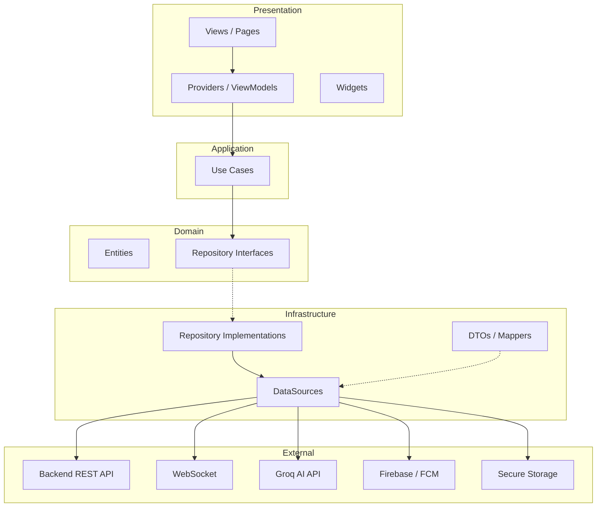
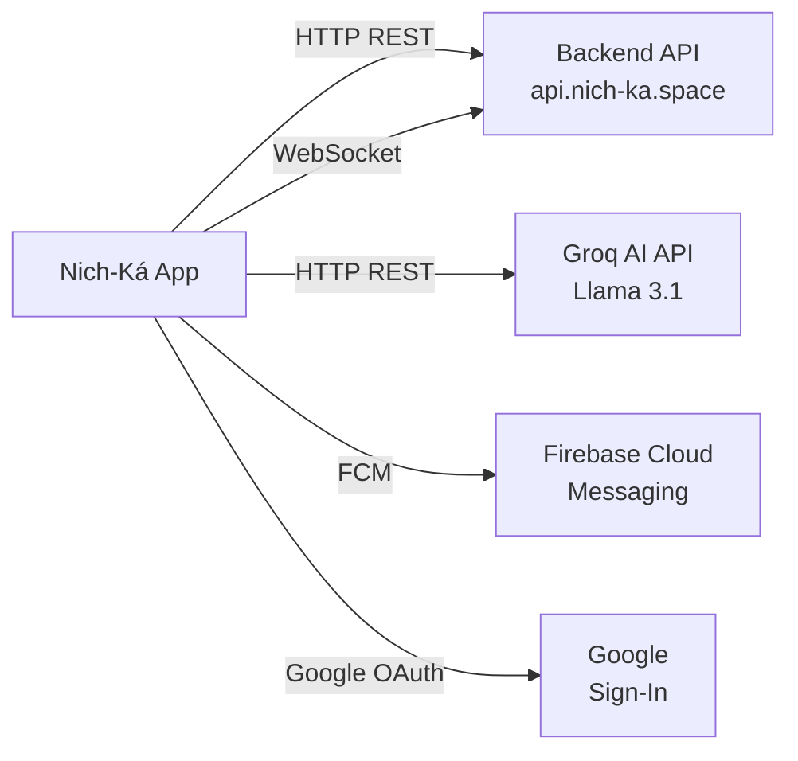

# Arquitectura de la Aplicación

Documento técnico que describe la arquitectura de software, patrones de diseño, capas y responsabilidades de la aplicación móvil Nich-Ká.

> **Versión documentada:** `1.0.0+22`

---

## Índice

- [Visión general](#visión-general)
- [Patrones de diseño](#patrones-de-diseño)
- [Capas de la arquitectura](#capas-de-la-arquitectura)
- [Diagrama de arquitectura](#diagrama-de-arquitectura)
- [Flujo de dependencias](#flujo-de-dependencias)
- [Capa Core](#capa-core)
- [Capa Features](#capa-features)
- [Capa Shared](#capa-shared)
- [Comunicación con servicios externos](#comunicación-con-servicios-externos)
- [Patrón de estado (UiState)](#patrón-de-estado-uistate)

---

## Visión general

Nich-Ká utiliza una arquitectura **híbrida** que combina tres enfoques probados:

| Patrón | Uso en el proyecto |
|---|---|
| **Clean Architecture** | Separación estricta Domain → Application → Infrastructure → Presentation |
| **Vertical Slicing (Screaming Architecture)** | Cada feature es un módulo independiente que refleja el negocio |
| **MVVM** | La UI es reactiva y "tonta"; la lógica vive en ViewModels/Providers |

La aplicación está diseñada para ser **modular**, **escalable** y **testeable**, donde cada feature puede desarrollarse y mantenerse de forma independiente.

---

## Patrones de diseño

### Clean Architecture

Cada feature internamente sigue las capas de Clean Architecture:

```
┌─────────────────────────────────────────────────┐
│                 PRESENTATION                      │
│  Views · ViewModels/Providers · Widgets · States  │
├─────────────────────────────────────────────────┤
│                APPLICATION                        │
│  Use Cases · Services                            │
├─────────────────────────────────────────────────┤
│                  DOMAIN                           │
│  Entities · Value Objects · Repository Interfaces │
├─────────────────────────────────────────────────┤
│               INFRASTRUCTURE                      │
│  DataSources · Repository Impls · DTOs · Mappers  │
└─────────────────────────────────────────────────┘
```

### Vertical Slicing (Screaming Architecture)

Las features se organizan por **dominio de negocio**, no por tipo técnico. Al ver la estructura de carpetas se entiende inmediatamente qué hace la aplicación:

```
features/
├── auth/           → Autenticación
├── home/           → Dashboard y asistente
├── fermentation/   → Lotes de fermentación
├── sensors/        → Lecturas de sensores
├── messages/       → Mensajería
├── chat/           → Asistente IA
├── reports/        → Reportes y análisis
├── class/          → Gestión de clases
├── profile/        → Perfil de usuario
├── notifications/  → Notificaciones push y WebSocket
├── calculator/     → Calculadora de eficiencia
├── simulator/      → Simulador de fermentación
└── legal/          → Términos y política de privacidad
```

### MVVM en la capa de presentación

```
View (Widget) ←→ ViewModel (ChangeNotifier/Provider) ←→ Use Case
```

- **View**: Widget de Flutter, solo construye UI basándose en el estado del ViewModel.
- **ViewModel**: `ChangeNotifier` o `StateNotifier` que gestiona el estado y ejecuta casos de uso.
- **Use Case**: Orquesta la lógica de negocio sin conocer la UI.

### Repository Pattern

Todas las fuentes de datos están abstraídas detrás de interfaces (contratos) definidas en la capa `domain/repositories/`. Las implementaciones concretas viven en `infrastructure/repositories/`.

---

## Capas de la arquitectura

### Diagrama de capas



### Flujo de dependencias (regla de oro)

> **Las capas externas dependen de las internas. La capa Domain no conoce a ninguna otra capa.**

```
UI (View) → ViewModel → Use Case (Application) → Repository Interface (Domain)
    → Repository Impl (Infrastructure) → DataSource
```

---

## Capa Core

`lib/core/` contiene los servicios y configuraciones **globales** compartidos por todas las features:

| Módulo | Responsabilidad |
|---|---|
| `core/router/` | Definición de rutas con GoRouter |
| `core/network/` | Cliente HTTP centralizado (singleton con manejo de tokens) |
| `core/auth/` | SessionManager (guardado seguro de sesión) y BiometricService |
| `core/providers/` | AuthProvider global (estado de autenticación) |
| `core/push/` | PushService para notificaciones FCM |
| `core/theme/` | Tema claro/oscuro (AppTheme con Material 3) |
| `core/presentation/` | AppThemeProvider, UiState sealed classes |
| `core/navigation/` | Lógica de ruta de entrada tras login |
| `core/session/` | Fuente única del avatar del usuario actual |
| `core/audio/` | Servicio de sonidos y chat activo |
| `core/validation/` | Validadores reutilizables (email, password, nombre) |
| `core/utils/` | Utilidades generales (parseo de fechas del servidor) |

---

## Capa Features

Cada feature es un **módulo vertical completo** con exactamente 4 capas internas:

### 1. Domain (núcleo del negocio)

No depende de Flutter ni de paquetes externos.

```
domain/
├── entities/          # Modelos de negocio puros (clases Dart)
├── use_cases/         # Casos de uso (un caso = una acción de negocio)
└── repositories/      # Contratos (interfaces abstractas)
```

### 2. Application (orquestación)

```
application/
└── use_cases/         # Implementación de la lógica de negocio
```

> Nota: En este proyecto, los use cases se encuentran directamente en `domain/use_cases/` ( Clean Architecture clásica).

### 3. Infrastructure (comunicación con el mundo exterior)

```
infrastructure/
├── datasources/
│   ├── remote/        # Llamadas HTTP, WebSocket
│   │   ├── mapper/    # Conversión DTO → Entity
│   │   └── model/
│   │       ├── dto/   # Data Transfer Objects (request/response)
│   │       └── ...    # Modelos de datos externos
│   └── local/         # Almacenamiento local, archivos
├── repositories/      # Implementación de los contratos de Domain
├── services/          # Servicios de infraestructura (WebSocket, etc.)
└── di/                # Inyección de dependencias de la feature
```

### 4. Presentation (interfaz de usuario)

```
presentation/
├── pages/             # Pantallas principales
├── components/        # Widgets exclusivos de la feature
├── providers/         # ViewModels (ChangeNotifier / StateNotifier)
├── states/            # Clases UiState (Idle, Loading, Success, Error)
├── theme/             # Paleta de colores propia de la feature (opcional)
└── notifier/          # Notifiers adicionales (en auth, por ejemplo)
```

---

## Capa Shared

`lib/shared/` contiene componentes reutilizables en múltiples features:

| Módulo | Contenido |
|---|---|
| `shared/components/` | AppDrawer, BottomNavBar, MainAppBar, tab icons, etc. |
| `shared/pages/` | Páginas compartidas (UserDetailView) |
| `shared/providers/` | Providers compartidos (UserDetailProvider) |
| `shared/theme/` | Paleta de colores global (AppPalette) |
| `shared/utils/` | Navegación del drawer, bottom nav, guardar archivos |

---

## Comunicación con servicios externos

La app se comunica con 4 servicios principales:



| Servicio | Protocolo | Propósito |
|---|---|---|
| Backend Nich-Ká | HTTP REST + WebSocket | Datos de usuarios, fermentaciones, sensores, mensajes, clases, reportes |
| Groq API | HTTP REST | Asistente IA (Llama 3.1 8B Instant) |
| Firebase Cloud Messaging | FCM | Notificaciones push en segundo plano |
| Google Sign-In | OAuth 2.0 | Autenticación con cuenta de Google |

Detalle completo en [docs/api-integration.md](docs/api-integration.md).

---

## Patrón de estado (UiState)

Todas las features usan un sealed class uniforme para representar el estado de la UI:

```dart
sealed class UiState<T> {
  const UiState();
}

class UiIdle<T> extends UiState<T> { const UiIdle(); }
class UiLoading<T> extends UiState<T> { const UiLoading(); }
class UiSuccess<T> extends UiState<T> { final T data; const UiSuccess(this.data); }
class UiError<T> extends UiState<T> { final String message; const UiError(this.message); }
```

Esto garantiza que **cada pantalla maneja exactamente 4 estados**: inactivo, cargando, éxito y error.

---

## Enlaces

- [← Estructura del proyecto](project-structure.md)
- [Configuración →](configuration.md)
