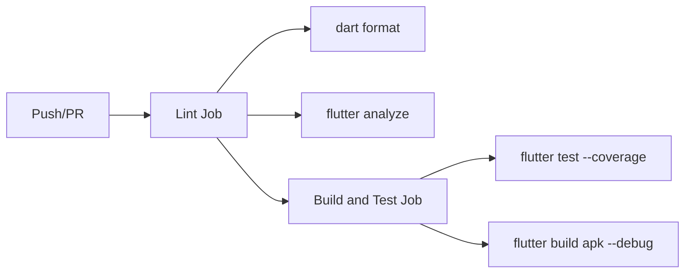
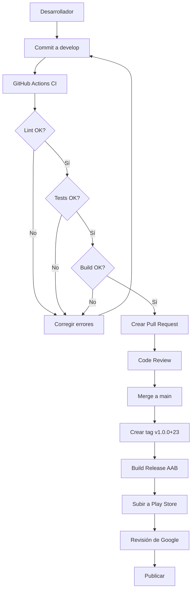

# Despliegue y Publicación

Documento que describe el proceso de compilación, generación de APK/AAB y despliegue de la aplicación Nich-Ká en producción.

> **Versión documentada:** `1.0.0+22`

---

## Índice

- [Visión general](#visión-general)
- [Compilación para producción](#compilación-para-producción)
- [Firmado de la APK/AAB](#firmado-de-la-apkaab)
- [Generación de APK](#generación-de-apk)
- [Generación de App Bundle (AAB)](#generación-de-app-bundle-aab)
- [Configuración de Play Store](#configuración-de-play-store)
- [CI/CD con GitHub Actions](#cicd-con-github-actions)
- [Flujo de despliegue](#flujo-de-despliegue)
- [Despliegue Web](#despliegue-web)

---

## Visión general

La aplicación se compila como:

| Formato | Uso | Comando |
|---|---|---|
| **APK** | Instalación directa / pruebas | `flutter build apk` |
| **AAB** | Google Play Store | `flutter build appbundle` |
| **Web** | Navegador | `flutter build web` |

---

## Compilación para producción

### Variables de entorno

Para builds de producción, las variables de entorno se inyectan en tiempo de compilación:

```bash
flutter build apk --release \
  --dart-define=BASE_URL=https://api.nich-ka.space/api \
  --dart-define=GROQ_API_KEY=tu_api_key
```

### Configuración de release

El `build.gradle.kts` configura automáticamente el release build:

```kotlin
buildTypes {
    release {
        signingConfig = if (keyPropertiesFile.exists())
            signingConfigs.getByName("release")
        else
            signingConfigs.getByName("debug")
    }
}
```

---

## Firmado de la APK/AAB

### Generar keystore de producción

```bash
keytool -genkey -v -keystore nich-ka-release.jks -keyalg RSA -keysize 2048 -validity 10000 -alias nich-ka
```

### Crear `android/key.properties`

```properties
storePassword=tu_password
keyPassword=tu_password
keyAlias=nich-ka
storeFile=path/to/nich-ka-release.jks
```

> **Importante:** `key.properties` NO debe commitearse al repositorio.

### Configuración en build.gradle.kts

El archivo `android/app/build.gradle.kts` lee automáticamente `key.properties` si existe:

```kotlin
val keyProperties = Properties()
val keyPropertiesFile = rootProject.file("key.properties")
if (keyPropertiesFile.exists()) {
    keyProperties.load(FileInputStream(keyPropertiesFile))
}
```

---

## Generación de APK

### APK universal (recomendado para pruebas)

```bash
flutter build apk --release
```

**Salida:** `build/app/outputs/flutter-apk/app-release.apk`

### APK por arquitectura (para tamaño reducido)

```bash
# ARM64 (dispositivos modernos)
flutter build apk --release --target-platform android-arm64

# ARM (dispositivos antiguos)
flutter build apk --release --target-platform android-arm

# x86_64 (emuladores)
flutter build apk --release --target-platform android-x64
```

### Tamaño aproximado

| Tipo | Tamaño estimado |
|---|---|
| APK universal | ~25-35 MB |
| APK por arquitectura | ~10-15 MB |

---

## Generación de App Bundle (AAB)

Para publicar en Google Play Store, se debe generar un App Bundle:

```bash
flutter build appbundle --release
```

**Salida:** `build/app/outputs/bundle/release/app-release.aab`

### Ventajas del AAB

- Google Play genera APK optimizadas automáticamente
- Soporte para APKs dinámicas (split por ABI)
- Reducción del tamaño de descarga para el usuario
- Cumplimiento con requisitos de Play Store

---

## Configuración de Play Store

### Datos de la aplicación

| Campo | Valor |
|---|---|
| `applicationId` | `com.nichka.app` |
| `minSdkVersion` | Flutter minSdkVersion |
| `targetSdkVersion` | Flutter.targetSdkVersion |
| `versionCode` | `22` (incrementar en cada release) |
| `versionName` | `1.0.0` |

### Permisos declarados en AndroidManifest

| Permiso | Justificación requerida |
|---|---|
| `CAMERA` | Escaneo de códigos QR para unirse a clases |
| `READ_MEDIA_IMAGES` | Selección de foto de perfil desde galería |
| `POST_NOTIFICATIONS` | Notificaciones de fermentaciones y mensajes |
| `USE_BIOMETRIC` | Login rápido con huella digital |

### Deep Links

| Tipo | URL |
|---|---|
| App Link | `https://nich-ka.space/join?code=...` |
| Auto-verify | Habilitado en AndroidManifest |

### Proceso de publicación

1. Generar AAB con `flutter build appbundle --release`
2. Incrementar `versionCode` en `pubspec.yaml`
3. Subir AAB a Google Play Console
4. Completar checklist de lanzamiento
5. Enviar para revisión
6. Publicar tras aprobación

---

## CI/CD con GitHub Actions

### Flujo automático

`.github/workflows/ci.yml` ejecuta en cada push/PR a `main` o `develop`:



### Jobs

#### 1. Lint

```yaml
- name: Verify formatting
  run: dart format --output=none --set-exit-if-changed lib/

- name: Analyze
  run: flutter analyze lib/
```

#### 2. Build and Test

```yaml
- name: Run tests
  run: flutter test --coverage

- name: Build APK
  run: flutter build apk --debug
```

### Configuración

| Campo | Valor |
|---|---|
| Flutter version | `3.41.9` |
| Channel | `stable` |
| Runner | `ubuntu-latest` |
| Cache | Habilitado |

---

## Flujo de despliegue



### Pasos para un release

1. Desarrollar y probar funcionalidad en `develop`
2. Crear PR de `develop` → `main`
3. Code review y aprobación
4. Merge a `main`
5. Incrementar versión en `pubspec.yaml`:
   ```yaml
   version: 1.0.0+23  # incrementar build number
   ```
6. Crear tag de Git:
   ```bash
   git tag v1.0.0+23
   git push origin v1.0.0+23
   ```
7. Generar build de producción:
   ```bash
   flutter build appbundle --release \
     --dart-define=BASE_URL=https://api.nich-ka.space/api \
     --dart-define=GROQ_API_KEY=tu_key
   ```
8. Subir AAB a Google Play Console
9. Completar información del release
10. Enviar para revisión

---

## Despliegue Web

### Build para web

```bash
flutter build web --release
```

**Salida:** `build/web/`

### Desplegar

El build de web se puede desplegar en cualquier servidor estático:

- Firebase Hosting
- GitHub Pages
- Netlify
- Vercel
- Servidor Nginx/Apache

### Limitaciones en web

| Funcionalidad | Disponible en Web |
|---|---|
| Login con email/password | ✅ |
| Login con Google | ✅ |
| Biometría | ❌ |
| Push notifications (FCM) | ❌ |
| WebSocket | ✅ |
| Sensores en tiempo real | ✅ |
| Escaneo QR | ❌ (usa cámara del navegador) |
| Almacenamiento seguro | ❌ (usa localStorage) |

---

## Enlaces

- [← Instalación](installation.md)
- [Módulo Dashboard →](modules/dashboard.md)
