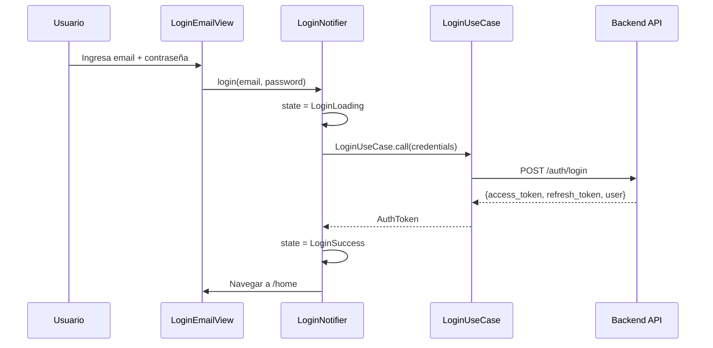
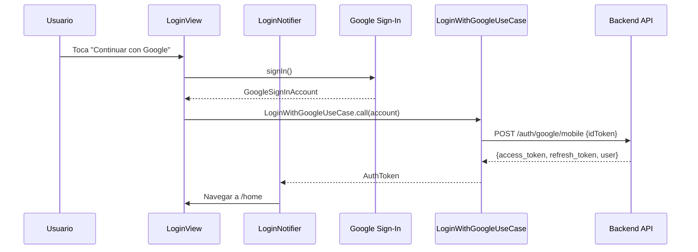

# Módulo: Autenticación

Documentación del módulo de Autenticación, que incluye login, registro, recuperación de contraseña, autenticación biométrica y gestión de sesión.

> **Ubicación:** `lib/features/auth/`

---

## Índice

- [Descripción](#descripción)
- [Pantallas](#pantallas)
- [Flujo de autenticación](#flujo-de-autenticación)
- [Componentes](#componentes)
- [Use Cases](#use-cases)
- [Entidades de dominio](#entidades-de-dominio)
- [Capa de datos](#capa-de-datos)
- [Inyección de dependencias](#inyección-de-dependencias)

---

## Descripción

El módulo de autenticación gestiona todo el ciclo de vida de la sesión del usuario:

- Login con email y contraseña
- Login con Google (OAuth)
- Recuperación de contraseña
- Cambio de contraseña
- Autenticación biométrica (huella/rostro)
- Persistencia de sesión (re-login automático)

---

## Pantallas

| Pantalla | Ruta | Descripción |
|---|---|---|
| `SplashGateView` | `/gate` | Pantalla de carga que decide la ruta inicial |
| `LoginView` | `/login` | Selección de método de login (Google/Email) |
| `LoginEmailView` | `/login-email` | Formulario de login con email y contraseña |
| `ForgotPasswordView` | `/forgot-password` | Solicitud de recuperación de contraseña |
| `ChangePasswordView` | `/change-password` | Formulario de cambio de contraseña |

---

## Flujo de autenticación

### Login principal

```mermaid
flowchart TD
    Start([App Inicia]) --> Gate[SplashGateView]
    Gate -->|¿Hay sesión?| SessionCheck{hasSession}
    SessionCheck -->|No| Login[/login]
    SessionCheck -->|Sí| BioCheck{¿Biometría?}
    BioCheck -->|Disponible| BioAuth{Autenticar}
    BioCheck -->|No disponible| Restore[SessionManager.restore]
    BioAuth -->|OK| Restore
    BioAuth -->|Falló| Login
    Restore -->|Token válido| RoleCheck{¿Rol = estudiante?}
    Restore -->|Token nulo| Login
    RoleCheck -->|No| ClearSession[Limpiar + Login]
    RoleCheck -->|Sí| SetUser[AuthProvider.setUser]
    SetUser --> EntryRoute[resolveEntryRoute]
    EntryRoute --> Home[/home o /]
```

### Login con email



### Login con Google



---

## Componentes

### Componentes de UI

| Componente | Propósito |
|---|---|
| `AuthTextField` | Campo de texto personalizado para auth |
| `AuthFieldLabel` | Label de campo de texto |
| `PrimaryAuthButton` | Botón principal de acción |
| `SocialLoginButton` | Botón de login social (Google) |
| `PasswordVisibilityToggle` | Toggle de visibilidad de contraseña |
| `SpotlightBackground` | Fondo decorativo con efecto spotlight |
| `LegalFooter` | Footer con links a términos y privacidad |

---

## Use Cases

| Caso de uso | Propósito |
|---|---|
| `LoginUseCase` | Login con email y contraseña |
| `LoginWithGoogleUseCase` | Login con Google OAuth |
| `SendForgotPasswordUseCase` | Enviar solicitud de recuperación |
| `ChangePasswordUseCase` | Cambiar contraseña |
| `LogoutUseCase` | Cerrar sesión y limpiar datos |

---

## Entidades de dominio

### AuthToken

```dart
class AuthToken {
  final String token;        // Access token JWT
  final int userId;          // ID del usuario
  final String name;         // Nombre
  final String lastName;     // Apellido
  final String email;        // Correo electrónico
  final String role;         // estudiante | profesor | admin
  final String? profileImage;// URL de foto (opcional)
  final String oauthProvider;// google | local
}
```

### AuthCredentials

```dart
class AuthCredentials {
  final String email;
  final String password;
}
```

---

## Capa de datos

### Endpoints utilizados

| Método | Endpoint | Descripción |
|---|---|---|
| `POST` | `/auth/login` | Login con credenciales |
| `POST` | `/auth/google/mobile` | Login con idToken de Google |
| `POST` | `/auth/forgot-password` | Solicitud de recuperación |
| `POST` | `/auth/logout` | Cierre de sesión |
| `POST` | `/auth/refresh/mobile` | Renovación de access token |
| `POST` | `/users/me/change-password` | Cambio de contraseña |

### DTOs

| DTO | Tipo | Propósito |
|---|---|---|
| `LoginRequestDto` | Request | Credenciales de login |
| `LoginResponseDto` | Response | Tokens y datos del usuario |
| `AuthUserResponseDto` | Response | Datos del usuario autenticado |
| `ForgotPasswordRequestDto` | Request | Email de recuperación |
| `ChangePasswordRequestDto` | Request | Contraseña antigua y nueva |

---

## Inyección de dependencias

```dart
// auth/di/auth_dependencies.dart

class AuthDependencies {
  static LoginUseCase get loginWithEmail => LoginUseCase(_repository);
  static LoginWithGoogleUseCase get loginWithGoogle => LoginWithGoogleUseCase(_repository);
  static SendForgotPasswordUseCase get sendForgotPassword => ...;
  static ChangePasswordUseCase get changePassword => ...;
  static LogoutUseCase get logout => ...;
}
```

---

## Enlaces

- [← Dashboard](dashboard.md)
- [Fermentaciones →](fermentation.md)
