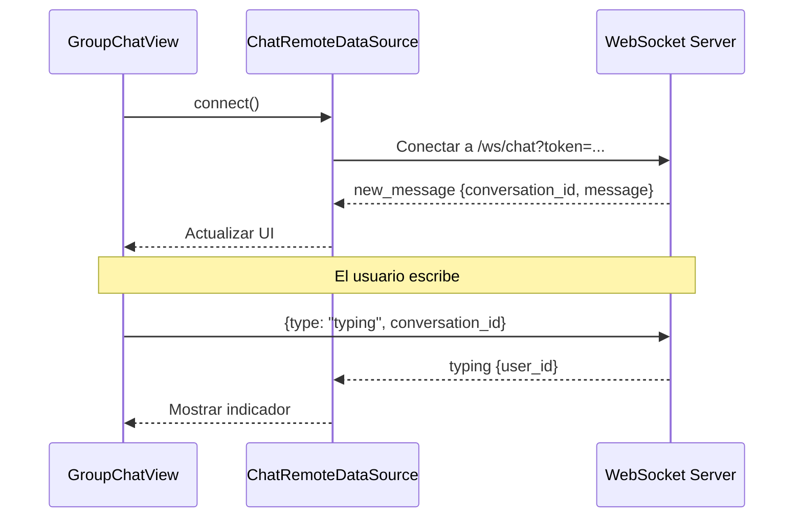

# Módulo: Mensajes

Documentación del módulo de Mensajería, que incluye聊天 grupal, conversaciones, stickers, reacciones y archivos adjuntos.

> **Ubicación:** `lib/features/messages/`

---

## Índice

- [Descripción](#descripción)
- [Pantallas](#pantallas)
- [Componentes](#componentes)
- [Providers](#providers)
- [Entidades de dominio](#entidades-de-dominio)
- [Capa de datos](#capa-de-datos)
- [Conexión WebSocket](#conexión-websocket)

---

## Descripción

El módulo de mensajes permite la comunicación entre estudiantes y profesores mediante聊天 individuales y grupales. Incluye soporte para stickers, reacciones, archivos adjuntos, mensajes fijados y edición de mensajes.

---

## Pantallas

| Pantalla | Ruta | Descripción |
|---|---|---|
| `MessagesView` | `/messages` | Lista de conversaciones |
| `GroupChatView` | `/group-chat` | Chat grupal o individual |

---

## Componentes

### Lista de conversaciones

| Componente | Propósito |
|---|---|
| `ConversationsList` | Lista de todas las conversaciones |
| `ConversationCard` | Tarjeta de cada conversación |
| `ConversationsSkeleton` | Skeleton de carga |
| `EmptyConversationsState` | Estado vacío |
| `MessagesErrorState` | Estado de error |
| `MessagesSearchBar` | Barra de búsqueda |
| `MessagesAppBar` | AppBar personalizado |
| `NewConversationSheet` | Bottom sheet para crear conversación |

### Chat

| Componente | Propósito |
|---|---|
| `ChatMessageBubble` | Burbuja de mensaje individual |
| `GroupMessageBubble` | Burbuja de mensaje grupal |
| `GroupMessageInput` | Campo de entrada para grupo |
| `ChatInputBar` | Barra de entrada del chat |
| `ReplyBar` | Barra de respuesta a mensaje |
| `EditBar` | Barra de edición de mensaje |
| `MessageActionsSheet` | Menú de acciones del mensaje |
| `ReactionsViewerSheet` | Visor de reacciones |
| `StickerPicker` | Selector de stickers |
| `ImageViewerPage` | Visor de imágenes |
| `GroupMembersSheet` | Hoja de miembros del grupo |

---

## Providers

| Provider | Tipo | Propósito |
|---|---|---|
| `MessagesProvider` | `ChangeNotifier` | Lista de conversaciones |
| `GroupChatProvider` | `ChangeNotifier` | Mensajes de un chat específico |

### Estados de MessagesProvider

```dart
enum MessagesUiState { loading, error, empty, success }
```

---

## Entidades de dominio

| Entidad | Propósito |
|---|---|
| `ChatConversation` | Conversación (id, nombre, tipo, miembros) |
| `ChatMessage` | Mensaje (id, contenido, autor, timestamp) |
| `ChatMember` | Miembro de una conversación |
| `GroupConversation` | Conversación grupal |
| `GroupMessage` | Mensaje grupal con info de autor |
| `MessageAttachment` | Archivo adjunto |
| `ReplyPreview` | Preview de respuesta a mensaje |
| `StickerPack` | Pack de stickers |

---

## Capa de datos

### Endpoints REST

| Método | Endpoint | Descripción |
|---|---|---|
| `GET` | `/chat/contacts` | Contactos disponibles |
| `POST` | `/chat/conversations` | Crear conversación |
| `GET` | `/chat/conversations` | Lista de conversaciones |
| `GET` | `/chat/conversations/{id}` | Detalle de conversación |
| `POST` | `/chat/conversations/{id}/members` | Agregar miembros |
| `POST` | `/chat/conversations/{id}/read` | Marcar como leída |
| `DELETE` | `/chat/conversations/{id}/leave` | Salir de conversación |
| `PATCH` | `/chat/conversations/{id}` | Actualizar conversación |
| `GET` | `/chat/conversations/{id}/messages` | Mensajes (paginado) |
| `POST` | `/chat/conversations/{id}/messages` | Enviar mensaje |
| `PATCH` | `/chat/messages/{id}` | Editar mensaje |
| `DELETE` | `/chat/messages/{id}` | Eliminar mensaje |
| `POST` | `/chat/messages/{id}/pin` | Fijar/desfijar |
| `PATCH` | `/chat/messages/{id}/priority` | Cambiar prioridad |
| `POST` | `/chat/messages/{id}/reactions` | Toggle reacción |
| `POST` | `/chat/uploads` | Subir archivo (multipart) |
| `GET` | `/stickers/packs` | Packs de stickers |

### Conexión WebSocket

**URL:** `wss://api.nich-ka.space/ws/chat?token=...`

**Eventos recibidos:**
- `new_message`: Nuevo mensaje
- `typing`: Indicador de escritura
- `presence`: Estado online/offline
- `delivered` / `read`: Estados de entrega
- `reaction`: Reacción a mensaje
- `pin`: Mensaje fijado
- `edit`: Mensaje editado
- `delete`: Mensaje eliminado
- `conversation_update`: Actualización de conversación

---

## Conexión WebSocket



---

## Enlaces

- [← Sensores](sensors.md)
- [Reportes →](reports.md)
