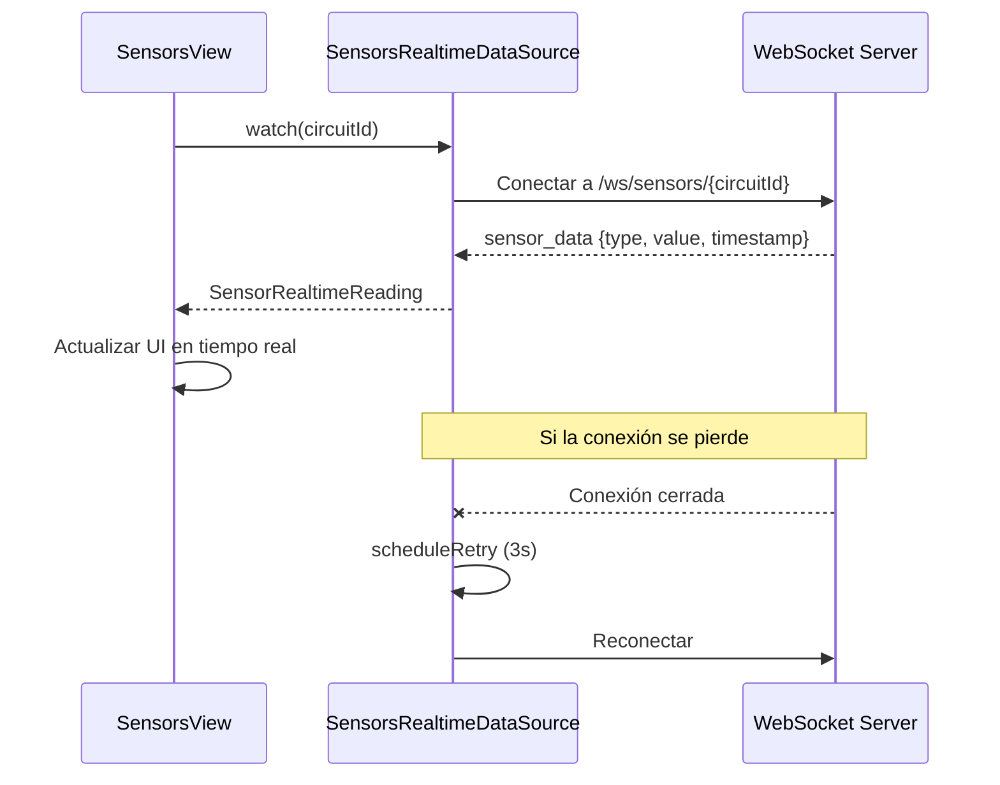

# Módulo: Sensores

Documentación del módulo de Sensores, que incluye la visualización de datos en tiempo real, gráficas y detalle de cada sensor.

> **Ubicación:** `lib/features/sensors/`

---

## Índice

- [Descripción](#descripción)
- [Pantallas](#pantallas)
- [Componentes](#componentes)
- [Providers](#providers)
- [Entidades de dominio](#entidades-de-dominio)
- [Capa de datos](#capa-de-datos)
- [Conexión WebSocket](#conexión-websocket)

---

## Descripción

El módulo de sensores muestra lecturas en tiempo real de los sensores IoT conectados a la fermentación. Utiliza conexiones WebSocket para recibir datos de pH, temperatura, turbidez, conductividad, % de alcohol y RPM.

---

## Pantallas

| Pantalla | Ruta | Descripción |
|---|---|---|
| `SensorsView` | `/sensors` | Panel principal con todos los sensores |
| `SensorDetailView` | `/sensor-detail` | Detalle de un sensor específico |

---

## Componentes

### Panel de sensores

| Componente | Propósito |
|---|---|
| `SensorCard` | Tarjeta de cada sensor con valor actual |
| `SensorsStatusCard` | Estado general de los sensores |
| `SensorStatsRow` | Fila de estadísticas (min, max, avg) |
| `SensorStatTile` | Tile de estadística individual |
| `SensorWindowSelector` | Selector de ventana de tiempo |

### Detalle de sensor

| Componente | Propósito |
|---|---|
| `SensorDetailChart` | Gráfica detallada del sensor |
| `SensorDetailChartPainter` | Painter personalizado de la gráfica |
| `SensorRangeBar` | Barra de rango del sensor |
| `SensorRangeBarPainter` | Painter de la barra de rango |
| `SensorSparklinePainter` | Sparkline del sensor |
| `SensorAiInsight` | Insight de IA sobre el sensor |

---

## Providers

| Provider | Tipo | Propósito |
|---|---|---|
| `SensorsProvider` | `ChangeNotifier` | Estado de la lista de sensores |
| `SensorDetailProvider` | `ChangeNotifier` | Detalle de un sensor específico |

---

## Entidades de dominio

| Entidad | Propósito |
|---|---|
| `SensorReading` | Lectura de un sensor (tipo, valor, unidad) |
| `SensorRealtimeReading` | Lectura en tiempo real con timestamp |
| `SensorRange` | Rango esperado del sensor (min, max) |
| `SensorsStatus` | Estado general de los sensores |

---

## Capa de datos

### Endpoints utilizados

| Método | Endpoint | Descripción |
|---|---|---|
| `GET` | `/users/me` | Obtener circuitId del usuario |

### Conexión WebSocket

**URL:** `wss://api.nich-ka.space/ws/sensors/{circuitId}?token=...`

**Servicio:** `SensorsRealtimeDataSource`

**Datos recibidos:**
- `sensor_data`: Lecturas de sensores en tiempo real
- `fermentation_stopped`: Notificación de fin de fermentación

**Reconexión:** Automática cada 3 segundos si se pierde la conexión.

---

## Conexión WebSocket

---

## Enlaces

- [← Fermentaciones](fermentation.md)
- [Mensajes →](messages.md)
