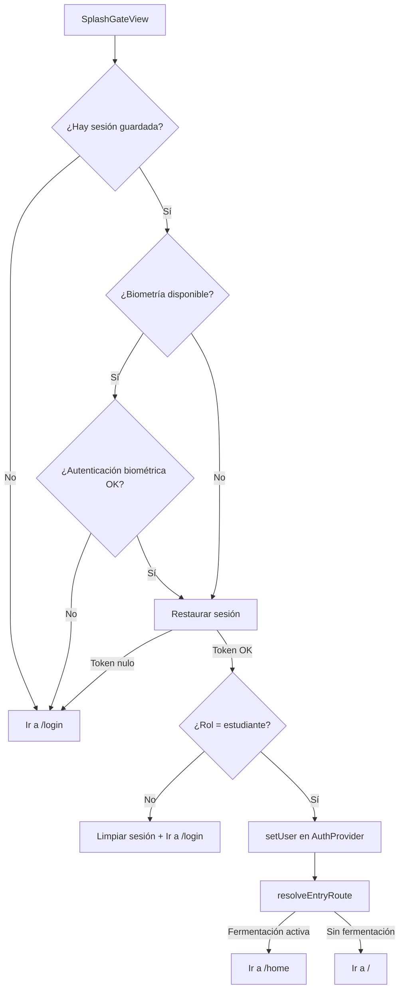

# Navegación entre Pantallas

Documento que describe el sistema de navegación, rutas, deep links y el flujo principal de la aplicación Nich-Ká.

> **Versión documentada:** `1.0.0+22`

---

## Índice

- [Sistema de navegación](#sistema-de-navegación)
- [Diagrama de flujo de navegación](#diagrama-de-flujo-de-navegación)
- [Rutas definidas](#rutas-definidas)
- [Flujo de entrada (SplashGate)](#flujo-de-entrada-splashgate)
- [Navegación por Drawer](#navegación-por-drawer)
- [Navegación por Bottom Nav](#navegación-por-bottom-nav)
- [Deep links](#deep-links)
- [Navegación con parámetros](#navegación-con-parámetros)

---

## Sistema de navegación

La aplicación usa **GoRouter** como sistema de rutas declarativo. Todas las rutas se definen en un solo archivo: `core/router/app_router.dart`.

```dart
final GoRouter appRouter = GoRouter(
  initialLocation: '/gate',
  redirect: (context, state) { ... },
  routes: [ ... ],
);
```

### Características

- Rutas planas (sin anidamiento profundo)
- Soporte de deep links (`/join?code=...`)
- Redirección automática según estado de autenticación
- Paso de datos entre pantallas mediante `state.extra`
- Error builder para rutas no encontradas

---

## Diagrama de flujo de navegación

```mermaid
flowchart TD
    Start([App Inicia]) --> Gate[/gate<br/>SplashGateView]
    Gate -->|Sin sesión| Login[/login<br/>LoginView]
    Gate -->|Con sesión + biometría OK| Auth[AuthProvider.setUser]
    Gate -->|Con sesión sin biometría| Login

    Login --> LoginEmail[/login-email<br/>LoginEmailView]
    Login --> Google[Login con Google]
    Login --> Forgot[/forgot-password]

    Auth -->|Rol != estudiante| Login
    Auth -->|Rol = estudiante| EntryRoute{resolveEntryRoute}

    EntryRoute -->|Fermentación activa| Home[/home<br/>HomeView]
    EntryRoute -->|Sin fermentación| HomeStudent[/ <br/>HomeStudentView]

    Home --> BottomNav[Bottom Nav Bar]
    HomeStudent --> BottomNav

    BottomNav -->|Inicio| Home
    BottomNav -->|Lotes| Fermentations[/fermentations]
    BottomNav -->|Sensores| Sensors[/sensors]
    BottomNav -->|Asistente| Chat[/chat]

    Home --> Drawer[App Drawer]
    Drawer --> Fermentations
    Drawer --> Sensors
    Drawer --> Chat
    Drawer --> Messages[/messages]
    Drawer --> Reports[/reports]
    Drawer --> Calculator[/calculator]
    Drawer --> Simulator[/simulator]
    Drawer --> Classes[/classes]
    Drawer --> Profile[/profile]
```

---

## Rutas definidas

### Rutas de autenticación

| Ruta | Pantalla | Descripción |
|---|---|---|
| `/gate` | `SplashGateView` | Pantalla de carga inicial, decide sesión |
| `/login` | `LoginView` | Selección de método de login |
| `/login-email` | `LoginEmailView` | Login con email y contraseña |
| `/forgot-password` | `ForgotPasswordView` | Recuperación de contraseña |
| `/change-password` | `ChangePasswordView` | Cambio de contraseña |

### Rutas principales

| Ruta | Pantalla | Descripción |
|---|---|---|
| `/` | `HomeStudentView` | Dashboard del estudiante (sin fermentación activa) |
| `/home` | `HomeView` | Dashboard con fermentación activa |
| `/overview` | `OverviewView` | Resumen general |

### Rutas de features

| Ruta | Pantalla | Descripción |
|---|---|---|
| `/fermentations` | `FermentationListView` | Lista de lotes de fermentación |
| `/fermentation` | `FermentationDetailView` | Detalle de un lote específico |
| `/sensors` | `SensorsView` | Panel de sensores en tiempo real |
| `/sensor-detail` | `SensorDetailView` | Detalle de un sensor específico |
| `/messages` | `MessagesView` | Lista de conversaciones |
| `/group-chat` | `GroupChatView` | Chat grupal/individual |
| `/chat` | `ChatView` | Asistente IA (Nich-KáBot) |
| `/reports` | `ReportsView` | Lista de reportes |
| `/report-detail` | `ReportDetailView` | Detalle de un reporte |
| `/notifications` | `NotificationsView` | Centro de notificaciones |
| `/classes` | `ClassListView` | Lista de clases |
| `/class-detail` | `ClassDetailView` | Detalle de una clase |
| `/class-members` | `ClassMembersView` | Miembros de una clase |
| `/class` / `/join` | `JoinClassView` | Unirse a clase por código o QR |
| `/simulator` | `SimulatorView` | Simulador de fermentación |
| `/calculator` | `CalculatorView` | Calculadora de eficiencia |
| `/profile` | `ProfileView` | Perfil de usuario |
| `/privacy` | `PrivacyPolicyView` | Política de privacidad |
| `/terms` | `TermsOfUseView` | Términos de uso |
| `/user-detail` | `UserDetailView` | Detalle de un usuario |
| `/assistant` | `AssistantView` | Asistente en Home |
| `/assistant-empty` | `AssistantEmptyView` | Estado vacío del asistente |

---

## Flujo de entrada (SplashGate)

El `SplashGateView` es la primera pantalla que se muestra al abrir la app. Ejecuta la siguiente lógica:



**Código clave:** `lib/features/auth/presentation/pages/splash_gate_view_state.dart`

---

## Navegación por Drawer

El `AppDrawer` ofrece acceso a todas las secciones principales:

| Item del Drawer | Ruta |
|---|---|
| Inicio | `/` o `/home` |
| Fermentaciones | `/fermentations` |
| Asistente | `/chat` |
| Mensajes | `/messages` |
| Calculadora | `/calculator` |
| Reportes | `/reports` |
| Simulador | `/simulator` |
| Sensores | `/sensors` |
| Clases | `/classes` |

El drawer también incluye:
- **Configuración** → `/profile`
- **Cerrar sesión** → Limpia tokens y sesión, redirige a `/login`

---

## Navegación por Bottom Nav

La barra de navegación inferior tiene 4 tabs principales:

| Tab | Ruta |
|---|---|
| Inicio | `/` o `/home` |
| Lotes | `/fermentations` |
| Sensores | `/sensors` |
| Asistente | `/chat` |

---

## Deep links

La app soporta deep links para unirse a clases:

### Android

```
https://nich-ka.space/join?code=XXXX
```

Configurado en `AndroidManifest.xml` con `intent-filter` auto-verificado.

### Comportamiento

1. Si el usuario **no tiene sesión**, el código se guarda en `pendingJoinCode` y se redirige a `/login`.
2. Tras el login exitoso, se consume el código pendiente.
3. Si el usuario **ya tiene sesión**, se abre directamente `JoinClassView` con el código.

---

## Navegación con parámetros

Algunas rutas reciben datos a través de `state.extra`:

| Ruta | Parámetro | Tipo |
|---|---|---|
| `/report-detail` | `sessionId` | `int?` |
| `/sensor-detail` | `reading` | `SensorReading` |
| `/class-detail` | `detail` | `ClassDetail` |
| `/class-members` | `extra` | `Map<String, dynamic>` (className + members) |
| `/user-detail` | `member` | `ClassMember` |
| `/group-chat` | `conversation` | `ChatConversation` |
| `/group-chat?highlight=` | `highlightMessageId` | `int?` (query param) |

---

## Enlaces

- [← Configuración](configuration.md)
- [Gestión de estado →](state-management.md)
