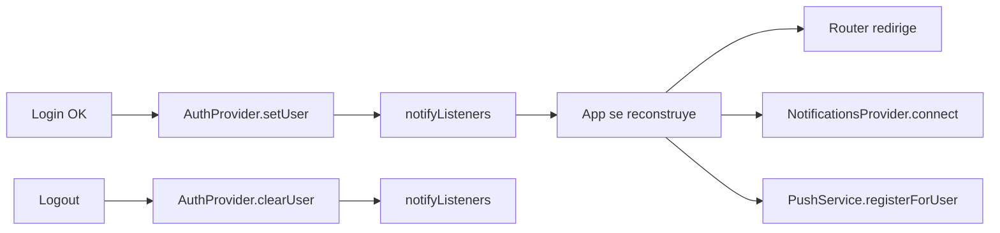
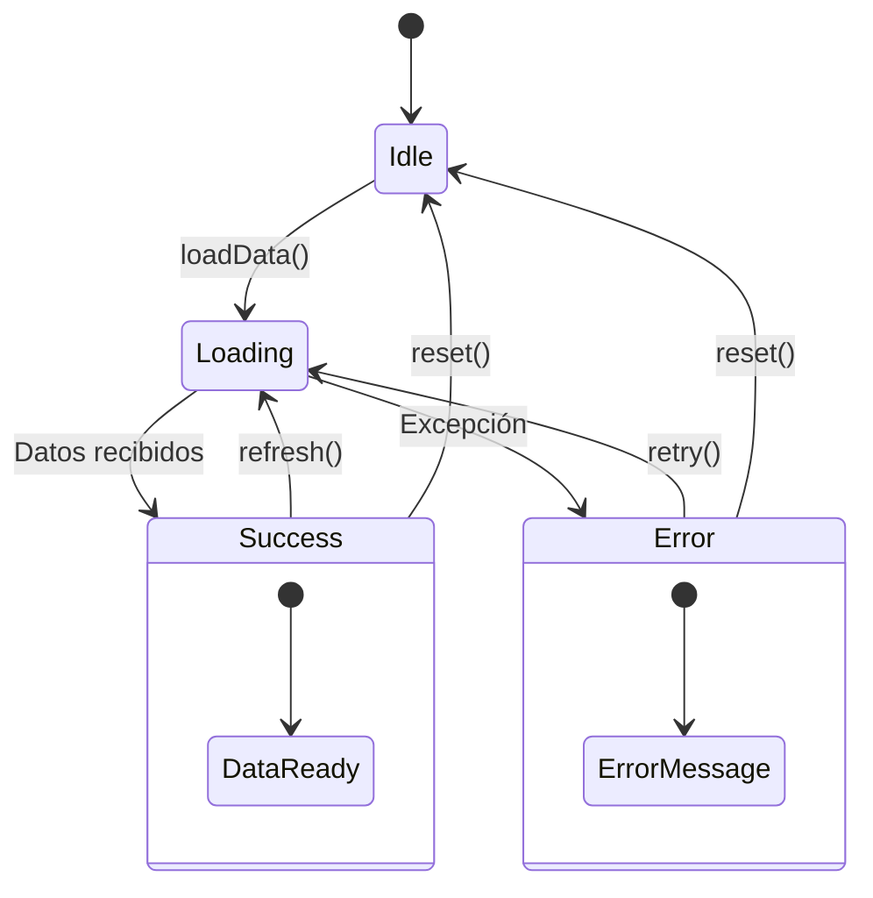

# Gestión de Estado

Documento que describe los patrones de gestión de estado implementados en Nich-Ká, incluyendo Provider, Riverpod y el sealed class `UiState`.

> **Versión documentada:** `1.0.0+22`

---

## Índice

- [Visión general](#visión-general)
- [Proveedor principal: Provider](#proveedor-principal-provider)
- [Proveedor secundario: Riverpod](#proveedor-secundario-riverpod)
- [Patrón UiState](#patrón-uistate)
- [AuthProvider (estado global)](#authprovider-estado-global)
- [Providers por feature](#providers-por-feature)
- [Diagrama de flujo de estado](#diagrama-de-flujo-de-estado)

---

## Visión general

Nich-Ká utiliza un sistema **híbrido** de gestión de estado:

| Paquete | Rol | Alcance |
|---|---|---|
| **Provider** | Estado principal de la app | Global (AuthProvider) + todas las features |
| **Riverpod** | Estado complementario | Features específicas que lo requieran |

La decisión de usar Provider como sistema principal se debe a su simplicidad, madurez y compatibilidad directa con `ChangeNotifier`.

---

## Proveedor principal: Provider

### Inyección global

Los providers globales se inyectan en la raíz de la app (`app.dart`):

```dart
MultiProvider(
  providers: [
    ChangeNotifierProvider(create: (_) => AppThemeProvider()),
    ChangeNotifierProvider(create: (_) => AuthProvider()),
    ChangeNotifierProxyProvider<AuthProvider, NotificationsProvider>(
      create: (_) => NotificationsProvider(),
      update: (_, auth, notif) {
        final n = notif ?? NotificationsProvider();
        if (auth.isLoggedIn) {
          n.connect();
          PushService.instance.registerForUser();
        } else {
          n.reset();
        }
        return n;
      },
    ),
  ],
  child: const _AppContent(),
)
```

### Patrón por feature

Cada feature crea sus providers localmente en el widget tree:

```dart
ChangeNotifierProvider<SomeProvider>(
  create: (_) => SomeProvider(),
  builder: (context, provider) {
    // UI que reacciona a provider.state
  },
)
```

---

## Proveedor secundario: Riverpod

Se inicializa con `ProviderScope` en `main.dart`:

```dart
runApp(
  ProviderScope(
    child: DevicePreview(
      enabled: !kReleaseMode,
      builder: (context) => const App(),
    ),
  ),
)
```

Se usa para features que requieren dependencias más complejas o inyección automática.

---

## Patrón UiState

Todas las features implementan un **sealed class** uniforme para representar el estado de la UI:

```dart
// core/presentation/ui_state.dart

sealed class UiState<T> {
  const UiState();
}

class UiIdle<T> extends UiState<T> {
  const UiIdle();
}

class UiLoading<T> extends UiState<T> {
  const UiLoading();
}

class UiSuccess<T> extends UiState<T> {
  final T data;
  const UiSuccess(this.data);
}

class UiError<T> extends UiState<T> {
  final String message;
  const UiError(this.message);
}
```

### Uso en providers

Cada provider gestiona un `UiState` que la UI consume:

```dart
class SomeProvider extends ChangeNotifier {
  UiState<SomeData> _state = const UiIdle();
  UiState<SomeData> get state => _state;

  Future<void> loadData() async {
    _state = const UiLoading();
    notifyListeners();

    try {
      final data = await _useCase.call();
      _state = UiSuccess(data);
    } catch (e) {
      _state = UiError(e.toString());
    }
    notifyListeners();
  }
}
```

### Uso en la UI

Las vistas usan `switch` exhaustivo para manejar cada estado:

```dart
return switch (provider.state) {
  UiLoading() => const CircularProgressIndicator(),
  UiError(:final message) => ErrorWidget(message: message),
  UiSuccess(:final data) => DataWidget(data: data),
  _ => const SizedBox.shrink(), // UiIdle
};
```

### Beneficios

- **Exhaustividad**: El compilador Dart obliga a manejar todos los estados
- **Claridad**: El código lee como un diagrama de estados
- **Seguridad**: No se puede olvidar manejar un estado de error
- **Consistencia**: Todas las features usan el mismo patrón

---

## AuthProvider (estado global)

El `AuthProvider` es el provider global más importante. Gestiona el estado de autenticación de toda la app:

```dart
// core/providers/auth_provider.dart

class AuthProvider extends ChangeNotifier {
  AuthToken? _user;

  AuthToken? get user => _user;
  bool get isLoggedIn => _user != null;
  String get role => _user?.role ?? '';
  int? get userId => _user?.userId;
  String get displayName =>
      _user != null ? '${_user!.name} ${_user!.lastName}' : '';

  void setUser(AuthToken token) {
    _user = token;
    notifyListeners();
  }

  void clearUser() {
    _user = null;
    notifyListeners();
  }
}
```

### Datos del usuario en sesión

La entidad `AuthToken` contiene:

| Campo | Tipo | Descripción |
|---|---|---|
| `token` | `String` | Access token JWT |
| `userId` | `int` | ID del usuario |
| `name` | `String` | Nombre |
| `lastName` | `String` | Apellido |
| `email` | `String` | Correo electrónico |
| `role` | `String` | Rol (estudiante, profesor, admin) |
| `profileImage` | `String?` | URL de foto de perfil |
| `oauthProvider` | `String` | Proveedor OAuth (google, local) |

### Propagación del estado



---

## Providers por feature

### auth

| Provider | Estado | Propósito |
|---|---|---|
| `LoginNotifier` | `LoginState` | Flujo de login (email/Google) |
| `ForgotPasswordNotifier` | `UiState` | Solicitud de recuperación |
| `ChangePasswordNotifier` | `ChangePasswordState` | Cambio de contraseña |

### home

| Provider | Estado | Propósito |
|---|---|---|
| `HomeProvider` | `UiState` | Datos del dashboard principal |
| `HomeStudentProvider` | `UiState` | Dashboard del estudiante |
| `OverviewProvider` | `UiState` | Datos de overview |
| `AssistantProvider` | `UiState` | Estado del asistente IA |

### fermentation

| Provider | Estado | Propósito |
|---|---|---|
| `FermentationListProvider` | `UiState` | Lista de lotes |
| `FermentationDetailProvider` | `UiState` | Detalle de un lote |

### sensors

| Provider | Estado | Propósito |
|---|---|---|
| `SensorsProvider` | `UiState` | Lista de sensores |
| `SensorDetailProvider` | `UiState` | Detalle de un sensor |

### messages

| Provider | Estado | Propósito |
|---|---|---|
| `MessagesProvider` | `MessagesUiState` | Lista de conversaciones |
| `GroupChatProvider` | `UiState` | Mensajes de un chat |

### notifications

| Provider | Estado | Propósito |
|---|---|---|
| `NotificationsProvider` | `UiState` | Lista de notificaciones + estado WebSocket |

### reports

| Provider | Estado | Propósito |
|---|---|---|
| `ReportsProvider` | `UiState` | Lista de reportes |
| `ReportDetailProvider` | `UiState` | Detalle de un reporte |

### class

| Provider | Estado | Propósito |
|---|---|---|
| `ClassListProvider` | `UiState` | Lista de clases |
| `ClassDetailProvider` | `UiState` | Detalle de una clase |
| `JoinClassProvider` | `UiState` | Unirse a una clase |

### profile

| Provider | Estado | Propósito |
|---|---|---|
| `ProfileProvider` | `UiState` | Datos del perfil |
| `DrawerProvider` | — | Estado del drawer |

### chat

| Provider | Estado | Propósito |
|---|---|---|
| `ChatProvider` | `UiState` | Mensajes del asistente IA |

### calculator / simulator

| Provider | Estado | Propósito |
|---|---|---|
| `CalculatorProvider` | — | Cálculos de eficiencia |
| `SimulatorProvider` | — | Parámetros y resultados de simulación |

---

## Diagrama de flujo de estado



---

## Enlaces

- [← Navegación](navigation.md)
- [Integración con APIs →](api-integration.md)
